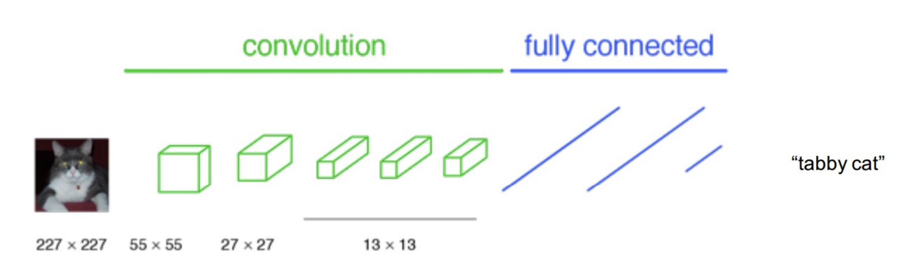
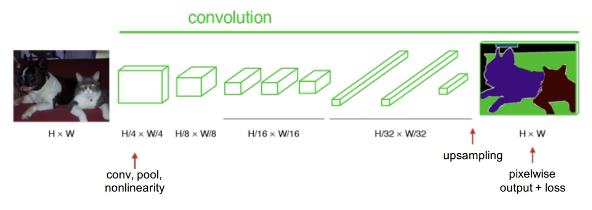
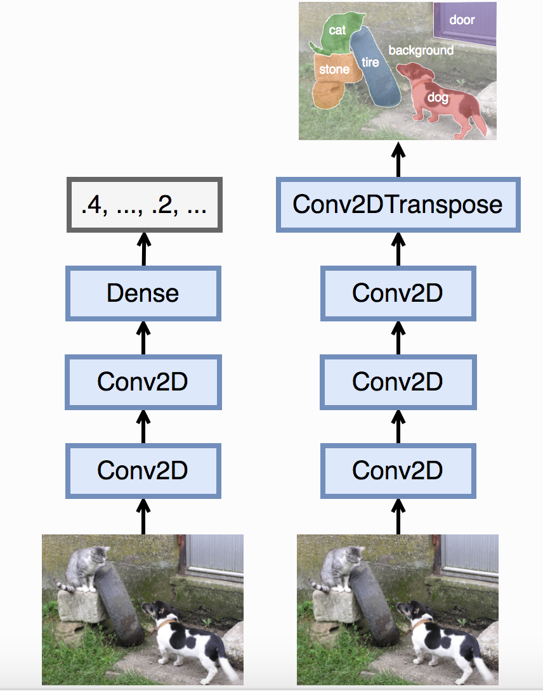
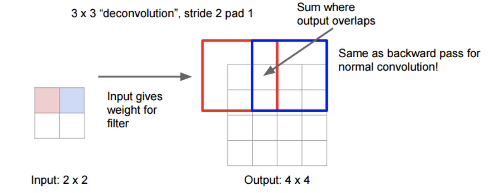
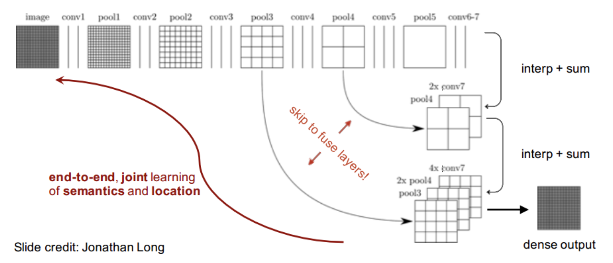

## Fully Convolutional Networks for Semantic Segmentation

##### CNN for image classification(input: image, output: class)

##### FCN for image semantic classification(input: image, output: image)

##### Compare between CNN for Image Classification and FCN for Semantic Segmentation:

#####  Adapting classifiers for dense prediction

- Fully connected layers can also be viewed as convolutions with kernels that cover their entire input regions.

- [how to convert](http://cs231n.github.io/convolutional-networks/#convert)

##### Loss Function
- Use `multi-class cross entropy` as loss function. assigning a class to each of our output pixels so this is a classification problem. Each pixel will have a `n-dimentional` vector, `n` is the number of class.

##### Upsampling and Transpose convolution layer

- Upsampling the output of a convnet to the original image resolution.

#### Enhance resolution 
- Interpolate with activations from prev layers.

##### References
<!---
comment
--->
- [paper](https://arxiv.org/pdf/1411.4038.pdf)
- `https://leonardoaraujosantos.gitbooks.io/artificial-inteligence/content/image_segmentation.html`

- `https://sherlockliao.github.io/2017/12/31/fcn/`

- `https://www.leiphone.com/news/201705/YbRHBVIjhqVBP0X5.html`

- `https://computing.ece.vt.edu/~f15ece6504/slides/L13_FCN.pdf`

- `https://zh.gluon.ai/chapter_computer-vision/fcn.html`
[//]: # (This may be the most platform independent comment)
