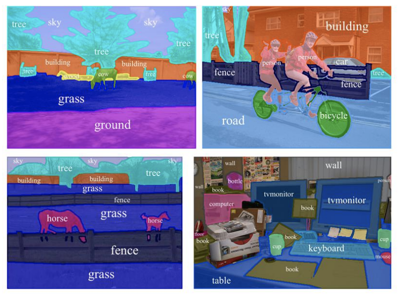
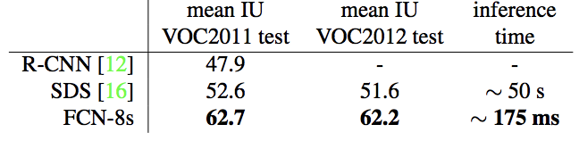

## Fully Convolutional Networks for Semantic Segmentation

### Idea of Semantic Segmentation
- Recognizing, understanding what's in the image in pixel
level. 

<!---
spatial output
arbitratry sized input
trainable upsampling

-->
### CNN for image classification(input: image, output: class)
- We lose spatial info when connent convolution layer with fully connected layer.

### FCN for image semantic classification(input: image, output: image)

### Compare between CNN for Image Classification and FCN for Semantic Segmentation:

- Instead of flattern the output of `conv2D` into `Dense`, FCN will plugin another `conv2D` and then transpose the output into the same size of the original input.

###  Adapting classifiers for dense prediction

- FCN can adapt the pre-trained model from CNN
- Fully connected layers can also be viewed as convolutions with kernels that cover their entire input regions.
- [how to convert](http://cs231n.github.io/convolutional-networks/#convert)

### Upsampling and Transpose convolution layer

- Upsampling the output of a convnet to the original image resolution.

### Enhance resolution 
- Interpolate with prev layers.

<!---
how skip can be helpful
Resnet
help with training when connect current layer 
--->

### Result

### Questions & TODOs
- Metrics and Results(TODO)
- Post process(CRF)

##### References
<!---
comment
--->
- [paper](https://arxiv.org/pdf/1411.4038.pdf)
- `https://leonardoaraujosantos.gitbooks.io/artificial-inteligence/content/image_segmentation.html`

- `https://sherlockliao.github.io/2017/12/31/fcn/`

- `https://www.leiphone.com/news/201705/YbRHBVIjhqVBP0X5.html`

- `https://computing.ece.vt.edu/~f15ece6504/slides/L13_FCN.pdf`

- `https://zh.gluon.ai/chapter_computer-vision/fcn.html`

- `http://www.cs.toronto.edu/~tingwuwang/semantic_segmentation.pdf`
[//]: # (This may be the most platform independent comment)

### Notes from teamates
###### Ming

- why skip is usefule. (Ming)
	- easy to train (ResNet)
	- keep spacial info
- Try different loss function. (Ming)

##### Lin

- why it's faster in training?(less param to train)
- Shift-and-stich?
- how will the context influence the output?
	- context? complex=>background, image contains a lot classes
	- context can affect for classification a lot. Same as segmentation.
- how will the __depth__ and __normal__ affect the segmentation
	- pixels on the same depth belong to the same class

	
- end-to-end
	- super pixel?
	- proposals, object detection, prefilter a smaller region

##### David

